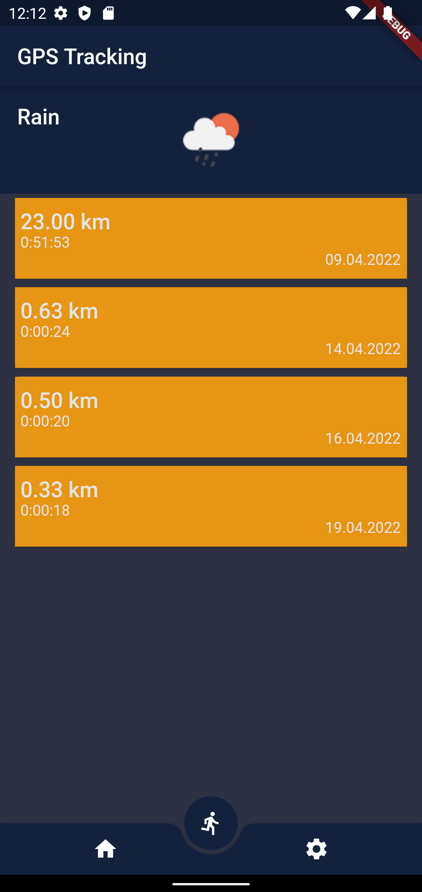
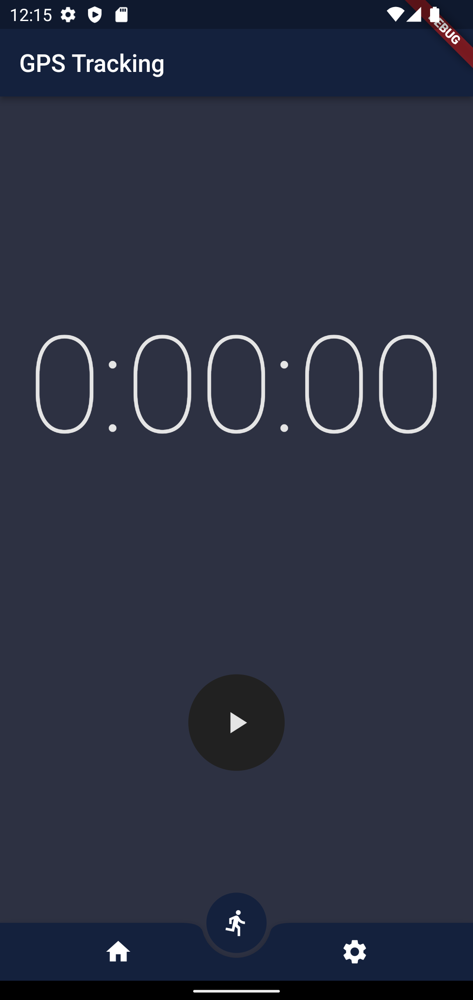
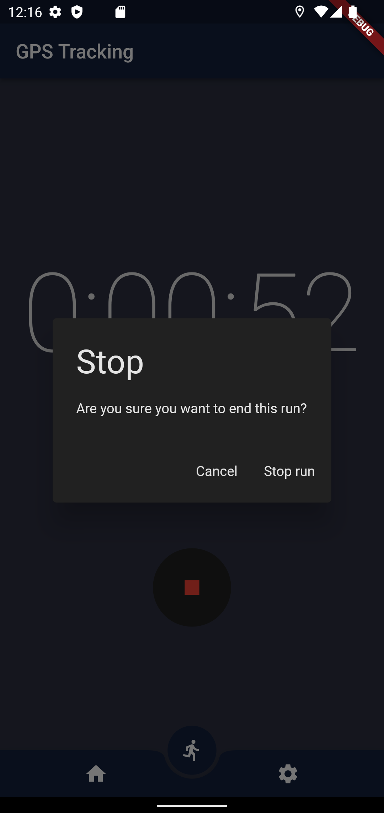

# A simple GPS-Tracker for running

App built with Flutter, OSM and Spring.

<!--  -->

## Starting a new run by simply pressing the start button.

## Stop the run by holding the stop button.

## coming features
- Accounts
- Share a run with your friends
- saving data offline if there is no internet connection
- data which is saved local on the device will be synchronizd with the server the next time an internet connection is available